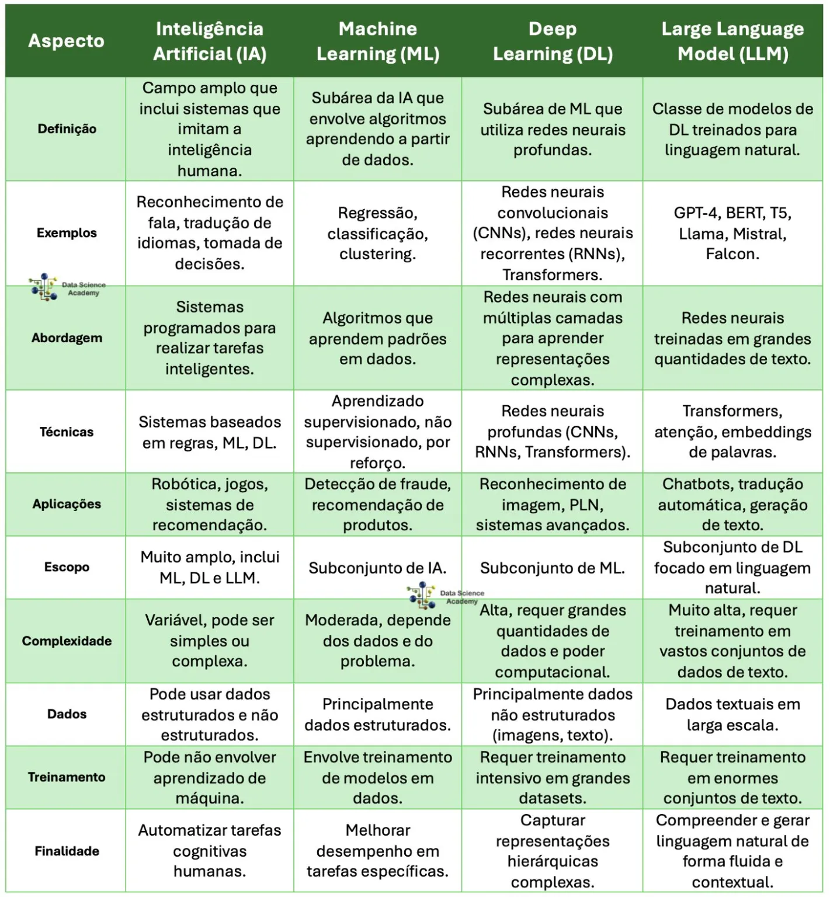

# Comparação: IA x Machine Learning x Deep Learning x LLM

Este repositório contém uma tabela comparativa entre os principais conceitos da área de Inteligência Artificial:  
- **Inteligência Artificial (IA)**  
- **Machine Learning (ML)**  
- **Deep Learning (DL)**  
- **Large Language Models (LLM)**  

---

### 📊 Tabela Comparativa: IA x Machine Learning x Deep Learning x LLM

*Fonte: [Data Science Academy - IA x Machine Learning x Deep Learning x LLM](https://blog.dsacademy.com.br/ia-x-machine-learning-x-deep-learning-x-llm/)*

---

## 📌 Principais Diferenças

- **IA (Inteligência Artificial):** Campo amplo que abrange todos os sistemas que simulam a inteligência humana.  
- **Machine Learning (ML):** Subárea da IA, foca em algoritmos que aprendem com dados.  
- **Deep Learning (DL):** Subárea do ML que utiliza redes neurais profundas para reconhecimento de padrões complexos.  
- **Large Language Models (LLM):** Modelos de DL especializados em linguagem natural, como GPT-4, BERT, T5 e LLaMA.  

---

## 🚀 Objetivo
Auxiliar na compreensão das diferenças, aplicações e usos de cada tecnologia, servindo como material de apoio para estudos e consultas rápidas.
